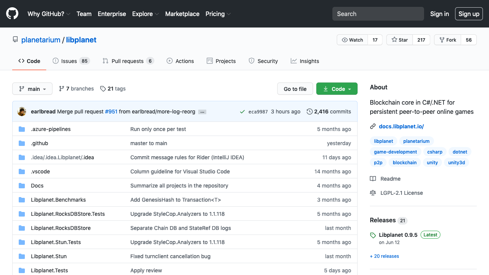
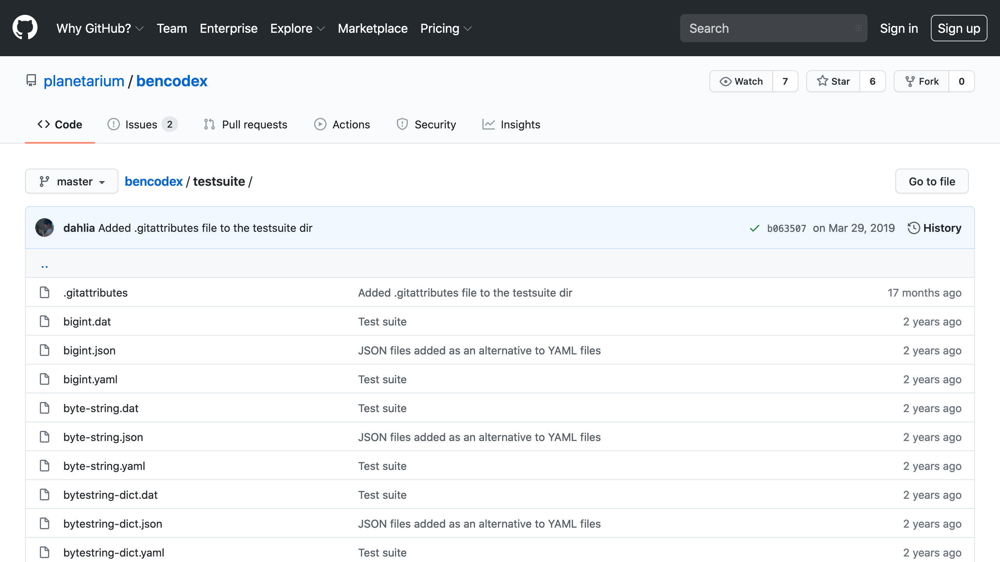
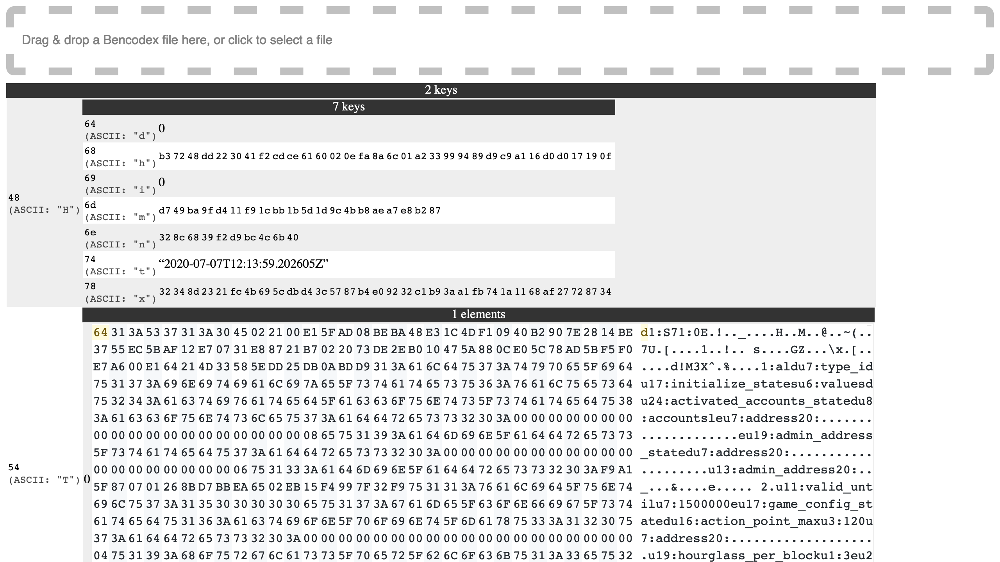
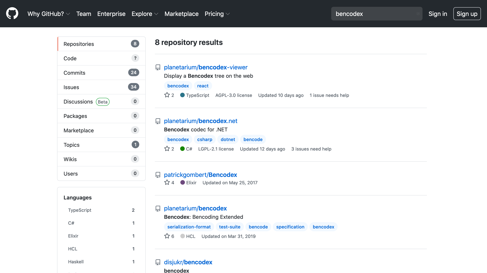
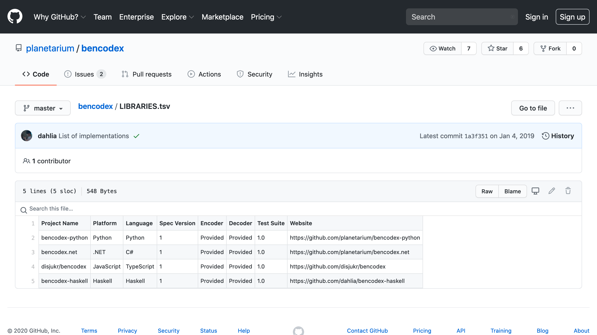

<!-- _class: main -->

직렬화 포맷 개량과 라이브러리 구현
==================================

플라네타리움 <planetariumhq.com>
이도건 <github.com/moreal>

<!--
목적 및 주제:
BitTorrent에서 쓰이는 직렬화 포맷인 bencode를 개량하고 그 구현을 파이썬으로 만든 경험 나누기

발표 시간: 약 30분 (총 40분에서 질답 10분 제외)
-->

<!--
안녕하세요, 파이콘 코리아 2020에서 '직렬화 포맷 개량과 라이브러리 구현' 이라는 주제로 발표하게된 플라네타리움 이도건이라고 합니다. 만나서 반갑습니다.
-->

---

## 이도건 | Moreal

- GitHub: github.com/moreal
- Email: { dev.moreal@gmail.com, dogeon@planetariumhq.com }

<!-- 본격적으로 소개를 하기전에 간단히 저의 소개를 하고자 하자면 GitHub에서 Moreal이라는 닉네임으로 활동하고 있고 플라네타리움에서 분산 시스템 엔지니어로 개발하고 있습니다. 오픈소스 활동을 정말 좋아하는 사람 중 한명입니다. -->

---

<!--
(약 3분/3매) **연사 및 프로젝트 소개**: 2년 전 네코유메 발표 인용, 현재 프로젝트인 9C & Libplanet 언급
-->

<!-- 우선 직렬화 포맷 개량을 하게 된 배경을 먼저 이야기 하고자 합니다. 그 배경은 김재석님이 파이콘 2018에서 발표하신 'Nekoyume 파이썬으로 만든 블록체인 기반 롤플레잉 게임' 이라는 발표로 다시 거슬러 올라갑니다. 해당 발표에서 발표하셨던 Nekoyume 라는 게임은 현재 다른 이름으로 계속 개발 진행중인데요 -->

---

<!-- 

 
// 피드백? :eyes: …

-->

# Libplanet

https://libplanet.io/

 *  게임에서 갖다 쓸 수 있는 네트워크 및 스토리지 라이브러리.
 *  중앙에서 누군가(≅ 게임사)가 서버를 운영하는 대신, 비트토렌트처럼 게이머의 기기끼리 통신.
 *  다음을 위해 블록체인 기술을 구현:
     * 모든 플레이어가 일관된 상태를 볼 수 있도록 (BFT 합의).
     * 중앙의 관계형 데이터베이스 등을 쓰지 않고도 영속성을 구현할 수 있도록.
     * 잠재적 악의적 플레이어(핵 유저, 치터)가 있어도 합의된 세계가 변조되지 않도록.

<!-- 현재는 나인크로니클 이라는 이름으로 이름을 바꾸고 Unity 기반의 블록체인 RPG 게임으로 만들어 나가고 있습니다, 또한 이전과 다르게 직접 Libplanet이라는 이름의 블록체인 엔진을 만들어서 사용하고 있습니다. -->

---

<!-- _class: image -->

<!-- 그리고 Libplanet은 LGPL-2.1-or-later로 배포되는 100% 오픈 소스 프로젝트입니다. -->

---

# 블록체인과 직렬화

<!--
(약 5분/5매) **프로젝트 맥락—암호학적 해시・디지털 서명과 직렬화 포맷의 관계**: 블록체인, 암호학적 해시 및 디지털 서명, 평문의 일관성 문제→직렬화 포맷들의 의미:표현이 1:多인 현실적인 문제들 (예: JSON에서 `"foo"`와 `"\u0066\u006f\u006f"`가 같은 의미지만 여러 방식으로 표현 가능)
-->

 *  블록체인의 모든 데이터는 암호학적 해시의 입력이 되거나, 디지털 서명의 입력이 된다.
 *  해시나 서명이 일치하지 않으면 입력도 동등하지 않다고 가정할 수 있어야 한다.
     * 그렇지 않으면 항상 해시·서명에 그 입력까지 동봉해야 한다.
     * 계산을 줄이기 위해서 해시를 쓰는 것인데 의미가 퇴색한다.

<!-- 그리고 블록체인과 직렬화의 관계에 대해서 이야기해보고자 합니다. 블록체인에서는 안에서 다루는 모든 데이터에 암호학적 해시와 디지털 서명을 사용합니다. 그리고 이러한 암호학적 해시나 디지털 서명의 입력으로 사용할 평문을 얻기 위해서 직렬화를 하고 암호학적 해시와 디지털 서명의 결과는 데이터의 무결성을 검사하기 위한 용도로 사용됩니다. 그렇기에 해시와 서명이 다를 경우 입력이 동등하지 않다는 가정을 세울 수 있는데 이 가정을 세울 수 없을 경우 항상 입력을 동봉하여 들고 다녀야 하고 계산을 줄이기 위해 사용하는 해시의 의미가 퇴색되기 때문에 좋지 못합니다. -->

---

# 동등한 값은 그 해시도 같아야 한다

| 항목       | 값                                         |
|------------|--------------------------------------------|
| Nonce      | 642                                        |
| Public Key | 028763f8ada886a8df32bdd2893e1e086…         |
| Signer     | 0xFe16BDed1DFB806FA6Ca6326dF2876cd1f0514A7 |
| Timestamp  | 2020-08-11 07:31:09.094 UTC                |

<!-- 이전 슬라이드에서 말한 가정을 지키기 위해 블록체인에서 사용되는 직렬화 포맷은 의미와 표현의 관계는 1:1일 필요가 있습니다. 예를 들며 설명하기 위해 블록체인에서 사용되는 트랜잭션의 필드와 값을 가져와 테이블로 띄워 보았습니다.  -->

---

# 직렬화의 대명사 JSON

~~~~ json
{
  "nonce": 642,
  "publicKey": "028763f8ada886a8df32bdd2893e1e086…",
  "signer": "fe16bded1dfb806fa6ca6326df2876cd1f0514a7",
  "timestamp": "2020-08-11T07:31:09.094Z"
}
~~~~

~~~~ console
$ sha1sum tx.json
02c14c49e16c142b3ef0746751004eb79599179a  tx.json
~~~~

<!-- 이를 직렬화 포맷 중 가장 널리 사용되는 직렬화의 대명사 JSON으로 표현해보았습니다. 이전 슬라이드의 테이블에 있던 필드와 값들을 모두 그대로 가져왔습니다. 그리고 보기 쉽게 indent를 넣고 순서 또한 동일하게 넣었습니다. 이렇게 직렬화 하였을 때의 값을 SHA1 해시로 게산했을때의 결과도 아래에 같이 표현했습니다. 결론부터 이야기하자면 저희는 JSON을 택할 수 없었습니다. 그 이유는 JSON은 같은 의미를 위 방식과 다르게 표현할 수도 있기 때문입니다. -->

---

# 직렬화의 대명사 JSON은 같은 값도 다르게 표현할 수 있다

~~~~ json
{
  "timestamp": "2020-08-11T07:31:09.094Z",
  "signer": "fe16bded1dfb806fa6ca6326df2876cd1f0514a7",
  "publicKey": "028763f8ada886a8df32bdd2893e1e086…",
  "nonce": 642
}
~~~~

~~~~ console
$ sha1sum tx.json
e3e07657b7ac147eb5cbae3ac3bee013786961f6  tx.json
~~~~

<!-- 이번에도 역시 예로 들었던 트랜잭션의 필드와 값을 JSON으로 표현해 보았습니다. 하지만 이번에는 순서를 조금 바꿔보았습니다. 필드와 값의 쌍을 그대로 놔둔채 말이죠. 이렇게 표현한 JSON을 SHA1으로 해싱하면 입력이 달라졌기 때문에 이전 슬라이드에서와는 다른 결과를 보여줍니다. 마지막으로 한 가지 예를 더 들어보겠습니다.  -->

---

# 직렬화의 대명사 JSON은 같은 값도 다르게 표현할 수 있다

~~~~ json
{"nonce":642,"publicKey":"028763f8ada886a8df32bdd2893e1e086…",
"signer":"fe16bded1dfb806fa6ca6326df2876cd1f0514a7","timestamp":
"2020-08-11T07:31:09.094Z"}
~~~~

~~~~ console
$ sha1sum tx.json
fa2a3813f85b7fc9221fe149d217234654b36f4a  tx.json
~~~~

<!-- 이번에는 순서는 동일하게 하는 대신 탭, 스페이스, 개행 같은 화이트스페이스 문자를 모두 없애보았습니다. 이 또한 JSON 문법에 맞는 표현 방식이고 파싱 또한 잘 될 것입니다. 하지만 이 역시 입력이 달라지기 때문에 SHA1 해시가 달라지는 것을 볼 수 있었습니다. -->

---

# 우리가 원하는 부호화

(Y: 입력, X 출력)

<!-- 저희가 원하는 해당 가정, …, 을 만족하는 직렬화 포맷은 Bijection이라고 불리는 전단사 함수의 특성을 지닐 필요가 있었습니다. 슬라이드에서 첨부한 이미지처럼 한 입력에 대해서 한 결과가 대응하는, 1:1 대응을 해야만 했었습니다. -->

그림 출처: [Bijection] — *Wikipedia*

[Bijection]: https://en.wikipedia.org/wiki/Bijection

---

# JSON

(Y: 입력, X 출력)

그림 출처: [Surjective_function] — *Wikipedia*

[Surjective_function]: https://en.wikipedia.org/wiki/Surjective_function

<!-- 반면에 JSON은 세 가지의 에를 들어가며 살펴보았듯이 한 의미에 대해서 여러가지 방법으로 표현 할 수 있었습니다. 다시 말해 본 슬라이드의 그림과 같이 한 의미에 대해 N개의 표현이 존재한다는 것이죠. 때문에 JSON을 직렬화 포맷으로 채용하기는 어려웠습니다.-->

---

# 입력∶출력

| 직렬화 포맷 | :no_mouth:  | 입력∶출력 |
|-------------|-------------|-----------|
| pickle      | :worried:   | 1∶N       |
| JSON        | :worried:   | 1∶N       |
| BSON        | :worried:   | 1∶N       |
| msgpack     | :worried:   | 1∶N       |

<!-- JSON 외에 pickle, BSON, msgpack 다른 직렬화 포맷들도 살펴보았지만 모두 입력과 출력의 관계가 1:N 이었습니다. 그 이유는 주로 딕셔너리에서 키 값의 순서를 스펙에서 정의하지 않거나 문자열 표현 방식을 제한하지 않았기 때문이었습니다. -->

---

# 선현의 지혜를 찾아

 *  다른 사람들은 어떻게 했을까?
 *  Libplanet과 비슷한 문제를 푸는 프로젝트들엔 뭐가 있을까?
 *  **비트토렌트!**

<!-- 그래서 이전에 있던 다른 사람들은, Libplanet과 비슷한 문제를 푸는 프로젝트에는 무엇이 있을지 찾아보기로 했습니다. 그래서 잘 생각해보니, 등잔 및이 어둡다고, 우리가 많이 쓰고 있는 비트토렌트가 떠올랐습니다. P2P 분산 네트워크 기술을 사용하고, 받을 파일이 같은 파일인지 다른 파일인지를 해시를 이용해서 체크하는 등, 목표는 다르지만 Libplanet과 많이 겹치는 문제들을 이미 푼 프로젝트니까요. -->

---

# Bencoding

 *  비트토렌트에서 쓰기 위해 만든 직렬화 포맷.
 *  마찬가지 이유(1∶N 대응)로 당시 많이 쓰이던 XML이나 pickle 등을 쓸 수 없었다.
 *  토렌트 파일(\*.torrent)은 토렌트 메타데이터를 bencoding한 결과.
 *  매그닛 주소는 토렌트 파일 내용을 해시한 것.
 *  1∶1 대응이 되므로 같은 파일은 같은 토렌트 파일 및 매그닛으로 표현된다.
    → 따라서 다른 사람과 더 잘 겹치고 공유가 더 잘 된다.

<!-- 그러한 비트토렌트는 Bencoding이라는 직렬화 포맷이 사용했습니다. 비트토렌트에서 쓰기 위해서 만들어졌던 직렬화 포맷이었고 생긴 이유도 저희가 겪고 있던 문제와 같이 1:N 대응 문제 때문에 당시 많이 쓰이던 XML이나 pickle을 사용할 수 없었기 때문이었습니다. 비트토렌트는 토렌트 메타데이터를 직렬화 할때 사용하고 그 토렌트 파일을 해시하여 매그닛 주소로 사용합니다. 1:1 대응이 되는 덕분에 같은 파일은 같은 토렌트 파일 및 매그닛으로 표현되어 잘 겹치고 공유가 더 잘 되는 장점을 가지게 되었죠.  -->

---

# 입력∶출력

| 직렬화 포맷 | :no_mouth:  | 입력∶출력 |
|-------------|-------------|-----------|
| pickle      | :worried:   | 1∶N       |
| JSON        | :worried:   | 1∶N       |
| BSON        | :worried:   | 1∶N       |
| msgpack     | :worried:   | 1∶N       |
| **bencode** | :satisfied: | 1∶1       |

<!--
(약 2분/4매) **JSON 등 기존 직렬화 포맷들의 현주소**: 찾아보니 우리 같은 문제를 옛날부터 풀어야 했던 프로젝트가 있더라… BitTorrent, BitTorrent는 어떻게 했을까? → Bencode라는 걸 쓰더라.
-->

<!-- Bencode, 저희가 원하던 1:1 대응이 되는 직렬화 포맷을 드디어 찾았습니다! 그래서 바로 사용하려고 했으나, -->

---

# Bencode의 시대적 한계

 *  2001년에 비트토렌트와 함께 만들어진 포맷.
 *  빈 값 (`None`) 지원 안 함.
 *  불 논리 값 (`True` 또는 `False`) 지원 안 함.
    → 파이썬에 `bool` 타입이 2002년에야 들어와서 ([PEP 285]).
 *  문자열은 모두 바이트 배열 (`b"..."`).
    유니코드 쓰려면 알아서 인코딩해야 함 (`u"...".encode(...)`).
    → 당시 파이썬 3는 나오기도 전이라 기본 문자열은 바이트 배열이었다.

[PEP 285]: https://www.python.org/dev/peps/pep-0285/

<!-- Bencode는 아무래도 비트토렌트와 함께 만들어진 포맷이었기 때문에 시대적인 한계가 있었습니다. 우선 빈 값, None을 지원하지 않았습니다. 그리고 True나 False같은 bool 논리 값 또한 지원하지 않았습니다. 그리고 문자열은 모두 바이트 배열이었고 유니코드를 쓰기 위해서는 알아서 인코딩 해서 사용해야 했었습니다. 하지만 그냥 그렇게 된 것이 아니라 파이썬에 bool 타입이 들어온 것이 2002년 부터였고 때느 파이썬 3가 나오기 이전이라 기본 문자열이 바이트 배열이었기 때문이었습니다. 말 그대로 시대적 한계인 것이죠. -->

---

# Bencodex: Bencoding Extended

<https://bencodex.org/>

<!--
(약 1분/1매) **“Bencode”를 개량한 “Bencodex”**: 위에서 얘기한 거 언급하며 추가했다고 자랑
-->

<!-- 그래서 Bencode를 확장한 직렬화 포맷을 정의하기로 했습니다. 확장하였기 때문에 Bencodex라고 이름을 붙였고 전 슬라이드에서 언급했던 Bencode에서 있던 시대적 한계를 해결하였습니다. -->

---

# bencodex-python

<github.com/planetarium/bencodex-python>

<!--
(약 12분/14매) **bencodex-python 구현**
-->

<!-- 그리고 비트토렌트에서 첫 구현체를 파이썬으로 만들었던 것 처럼, 파이썬으로 처음 구현체를 만들어 보기로 했습니다. 구현 특징에 대해 이야기하고 그렇다면 Bencodex는 어떻게 1:1 대응을 보장하는 지, 테스팅과 활용등에 대해서 이야기 해보고자 합니다. -->

---

# Bencodex의 모든 자료형은 파이썬에도 빌트인으로 있다

| 자료형          | Bencodex             | Python                    |
|-----------------|----------------------|---------------------------|
| 없음            | `n`                  | `None`                    |
| 불              | `t`/`f`              | `True`/`False`            |
| 정수            | `i3e`                | `3`                       |
| 바이트 열       | `4:spam`             | `b"Spam"`                 |
| 유니코드 문자열 | `u6:단팥`            | `u"단팥"`                 |
| 목록            | `l4:spamu4:eggse`    | `[b"spam", u"eggs"]`      |
| 사상 (사전)     | `du4:spaml1:au1:bee` | `{u"spam": [b"a", u"b"]}` |

<!--
(약 1분/1매) 다행히 Bencodex의 모든 자료형은 파이썬에서 빌트인 자료형들(`None`, `bool`, `int`, `list`, `dict`)만으로 커버 가능
-->

<!-- 우선 다행히도 Bencodex의 모든 자료형은 파이썬에서 None, bool, int, bytes, list, dict 같은 빌트인 자료형들만으로 표현이 가능했습니다. -->

---

# 파이썬 직렬화 모듈 API

 *  `marshal` → `pickle` → `json` 등으로 이어져 온 사실상의 표준
     *  `dump(obj: Any, file: IO[bytes]) -> None`
     *  `dumps(obj: any) -> bytes`
     *  `load(file: IO[bytes]) -> Any`
     *  `loads(string: bytes) -> Any`

<!--
(약 1분/3매) 파이썬에서의 직렬화 모듈의 de facto standard interface. bencodex-python도 그걸 따랐다.
-->

<!-- 또한 파이썬에는 marshal, pickle, json 등으로 표준 라이브러리에 포함된 직렬화 모듈에서 사용되는 사실상의 표준(de facto standard) 인터페이스가 있습니다. dump와 load, dumps와 loads가 그런 것인데요, bencodex-python도 이를 따라 구현하였고 사용자 입장에서는 보다 친숙한 경험을 얻을 수 있을 것입니다. -->

---

# typing 그리고 mypy 지원

 * [PEP 484]

[PEP 484]: https://www.python.org/dev/peps/pep-0484/
<!--
(약 9분/8매)
- `typing` 및 mypy 지원 (PEP 484) [6매]
- pip로 설치하면 바로 사용 가능 (PEP 561) [2매]
-->

<!-- 또한 PEP 484의 typing, 타입 힌트를 지원하고 이를 통해 mypy 타입 체커를 통해 런타임 이전에 오류를 사전에 방지할 수 있도록 하였습니다. -->

---

# 타입 검사

~~~~ python
from bencodex import dump

with open("file.dat", "wb") as f:
    dump(f, "value")  # 인자 순서 틀림
    # error: Argument 2 to "dump" has incompatible type "str"; expected "BinaryIO"
~~~~

<!-- 예를 들어 위와 같은 코드를 작성하고 mypy로 타입 검사를 하게되면 주석으로 달아놓은 것과 같은 에러 메시지와 함께 잘못된 순서로 넣었음을 사전에 알려줍니다. 만약 타입힌트를 추가하지 않았다면 이는 어려웠을 것이고 런타임이 되어서야 실수를 알아챌 것입니다. -->

---

# `bencodex.types.BValue`

 *  파이썬 자료형 가운데 Bencodex로 부호화 가능한 것들만 허용하는 타입
 *  …을 의도했지만…

<!--  그리고 타입 검사에서 파이썬 자료형 가운데 Becodex로 부호화가 가능한 것들만 허용하는 타입, BValue를 지원하려고 하였지만 -->

---

# bencodex/types.py `@1.0.1`

~~~~ python
from typing import Any

__all__ = 'BValue',

BValue = Any
# Mypy currently does not support recursive types.
# https://github.com/python/mypy/issues/731
~~~~

<!-- 그냥 Any임… -->

<!-- 실제로는 그냥 Any로 정의되어 있습니다. -->

---

# Mypy는 현재 재귀 타입 미지원

 *  `BValue`는 `bool`, `int` 같은 스칼라 값 외에도 목록이나 사전처럼 복잡한 값을 포함.
 *  그러나 이를 타입으로 표현하려면 `Sequence[BValue]`나 `Mapping[Union[str, bytes], BValue]`와 같이 타입 정의 안에 다시 `BValue`라는 이름이 등장할 수 있어야 함.
 *  타입 정의 안에 정의하려는 타입(`BValue`)을 쓸 수 있게 해주는 게 **recursive types**
    (예: `BValue = Union[..., Sequence[BValue]]`).
 *  Mypy는 아직 이 기능을 미지원해서 일단 `BValue = Any`로 정의해 둘 수밖에 없었다. :sob:
 *  그러나 mypy 측에서 해당 문제 해결 가능성도 보임!
    <github.com/python/mypy/issues/731>

<!--
(1분/2매) Mypy의 recursive types 미지원으로 인해 일단은 `BValue`의 형을 `Any`로 정의해 둠. 그러나 mypy 측에서 해당 문제 해결 가능성이 보임. https://github.com/python/mypy/issues/731
-->

<!-- 그 이유는 Mypy에서 recursive types를 미지원하기 때문입니다. BValue는 bool이나 int 같은 스칼라 값 외에도 list나 dict같은 복잡한 값을 포함하고 있고 이를 타입으로 표현하려면 슬라이드에 적어놓았듯이 Sequence, Mapping 등을 사용하여 타입 정의안에 BValue라는 타입을 사용할 수 있어야 했습니다. 이렇게 정의하는 타입 안에서 정의하려고하는 타입을 사용할 수있게 하는 것을 recursive types라고 하는데 Mypy에서 이 기능을 지원하지 않기 때문에 아쉽게도 Any로 남겨둘 수 밖에 없었습니다. 하지만 여전히 731번 이슈에서 stale 되지 않고 진행중이기 때문에 아직 해결 가능성도 보인다고 생각하고 본 문제가 해결이 되면 맨 처음 의도대로 BValue를 재정의 할 예정입니다.  -->

---

# Bencodex에서 입력:출력 1∶1 만족하는 원리

- 정규화
  - 사전 키 정렬 순서 정의
  - 정수 0를 표현하는 경우
    - [X] `i-0e`
    - [O] `i0e`

<!-- TODO: 사전(dict)의 키 순서를 임의로 섞는 것을 원천 차단, 정수 표현 방식에 있어서도 정확히 하나의 표현 방식만 존재함.  -->

<!-- NOTE: 정규화, 랜덤 접근 in https://j.mearie.org/post/122845365013/serialization -->

---

# bencodex/writer.py `@1.0.1`

~~~~ python
    elif isinstance(value, collections.abc.Mapping):
        …
        items = [
            (u, k.encode('utf-8') if u else k, v)
            for k, v in value.items()
            for u in [is_unicode(k)]
        ]
        items.sort()
        yield b'd'
        for u, k, v in items:
            if u:
                yield b'u'
            yield from write(k)
            yield from write(v)
        …
~~~~

<!-- TODO: 코드 리딩 -->

---

# Bencodex 명세 및 테스트 데이터

 *  Bencodex 명세는 테스트 데이터도 제공.

<!--
(약 1분/2매) 테스트는 Bencodex 쪽 스펙 데이터가 있어서 그걸 활용 https://github.com/planetarium/bencodex/tree/ce3bcb5c790ee5c1b88e4094f20f7b07abde1acb/testsuite
-->

---

<!-- _class: image -->

<!-- 기대되는 입력과 출력 값들을 제공, 이를 통해 테스트 코드에서 활용한다. -->

---

# bencodex/test.py `@1.0.1`

~~~~ python
def load_testsuite_data() -> Generator[Tuple[str, object, bytes], None, None]:
    pkg = 'bencodex'
    suffix_re = re.compile(r'\.ya?ml$')
    for filename in resource_listdir(pkg, 'spec/testsuite'):
        if not filename.lower().endswith(('.yaml', '.yml')):
            continue
        yaml_filename = 'spec/testsuite/' + filename
        data_filename = suffix_re.sub('.dat', yaml_filename)
        if not resource_exists(pkg, data_filename):
            continue
        yaml = load_yaml(resource_string(pkg, yaml_filename).decode('utf-8'))
        data = resource_string(pkg, data_filename)
        yield filename, yaml, data
~~~~

<!-- TODO: 코드 리딩, 테스트슈트들을 가져와서 테스트한다. -->

---

# Bencodex 구현체 및 보조 도구

 * [bencodex.net] - .NET
 * [bencodex-python] - Python
 * [disjukr/bencodex] - TypeScript
 * [bencodex-haskell] - Haskell
 * [bencodex-viewer] - Bencodex 웹 기반 시각화 도구
 
[bencodex.net]: https://github.com/planetarium/bencodex.net
[bencodex-python]: https://github.com/planetarium/bencodex-python
[disjukr/bencodex]: https://github.com/disjukr/bencodex
[bencodex-haskell]: https://github.com/dahlia/bencodex-haskell
[bencodex-viewer]: https://github.com/planetarium/bencodex-viewer

<!-- - (약 2분/2매) **기타 Bencodex 주변 도구**: 여담으로 다른 bencodex 구현체들, 보조 도구들 (bencodex-viewer) -->

<!-- 소개 -->

---

<!-- _class: image -->

<!-- 타입스크립트 구현체를 이용해서 Bencodex로 인코딩 된 바이너리 파일을 웹브라우저에서 볼 수도 있게 해놓았습니다. 그래서 실제 게임에서 운용중인 블록체인 혹은 상태 데이터를 볼 때 자주 사용하곤 합니다. 또한 이 프로젝트도 AGPL 3.0 라이센스로 배포된 오픈소스 프로젝트이기 때문에 이 발표를 듣고 관심이 있으신 분들은 디자인 개선이나 등 기여하실수도 있습니다! -->

---

<!-- _class: image -->

<!-- 또한 Bencodex로 깃허브에서 검색해보면 관련된 구현체 및 프로젝트들을 찾아볼 수 있습니다. 부가설명으로 세 번째에 나오는 프로젝트는 Bencodex가 아닌 Bencoding과 관련된 프로젝트입니다. -->

---

<!-- _class: image -->

<!-- 또한 라이브러리 구현체들을 스펙을 관리하는 리포지토리에서 LIBRARIES.tsv 라는 파일에서 관리하고 있어요. 실제로 본 언어에 붙여서 사용할 수 있을지 찾아보려 할 때 이전 슬라이드 같이 깃허브에서 검색해서 찾아볼 수도 있지만 이렇게 한 파일에서 정리해놓으면 찾기 더 수월하니깐요. 취미로 사용하고 있는 언어로 구현해보기에도 난이도 그렇게 높지 않아서 좋을 것 같아요. -->

---

# 질문과 답변

트위터: @dev_moreal
디스코드: <discord.gg/planetarium>

<!-- - (약 1분/1매) 홍보 타임: 채용 문구 및 링크, 주요 프로젝트 링크 -->

<!-- 지금까지 발표 들어주셔서 감사합니다. 본 발표와 관련된 질문을 하시고 싶지만 이번 파이콘 발표는 사전녹화로 진행되기 때문에 라이브로 바로 받기는 어려울 것 같아 제 트위터 계정이나 플라네타리움 디스코드 developer 채널에 놀러오셔서 질문 남겨주시면 답변해드리도록 하겠습니다. 감사합니다. -->
