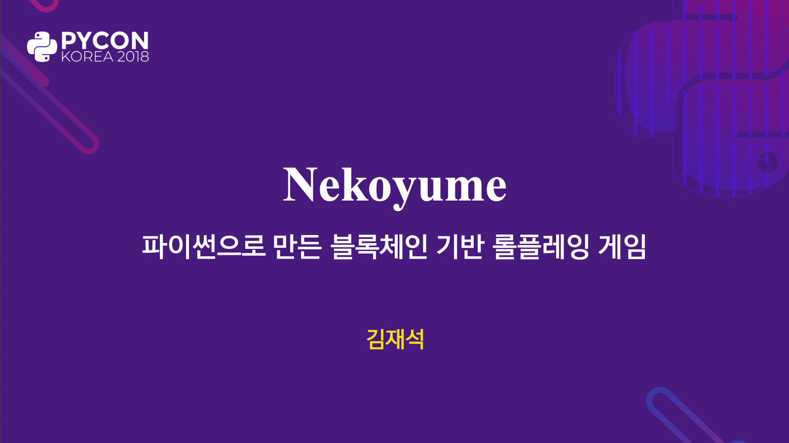

직렬화 포맷 개량과 라이브러리 구현
==================================

플라네타리움 <planetariumhq.com>
이도건 <github.com/moreal>

<!--
목적 및 주제:
BitTorrent에서 쓰이는 직렬화 포맷인 bencode를 개량하고 그 구현을 파이썬으로 만든 경험 나누기

발표 시간: 약 30분 (총 40분에서 질답 10분 제외)
-->

---

<!--
(약 3분/3매) **연사 및 프로젝트 소개**: 2년 전 네코유메 발표 인용, 현재 프로젝트인 9C & Libplanet 언급
-->

---

TODO 덜렁 로고 말고... 로고 + 무슨 게임인지 감 잡을 수 있는 스틸샷 이미지 하나 구해서 넣기

---

# Libplanet

https://libplanet.io/

 *  게임에서 갖다 쓸 수 있는 네트워크 및 스토리지 라이브러리.
 *  중앙에서 누군가(≅ 게임사)가 서버를 운영하는 대신, 비트토렌트처럼 게이머의 기기끼리 통신.
 *  다음을 위해 블록체인 기술을 구현:
     * 모든 플레이어가 일관된 상태를 볼 수 있도록 (BFT 합의).
     * 중앙의 관계형 데이터베이스 등을 쓰지 않고도 영속성을 구현할 수 있도록.
     * 잠재적 악의적 플레이어(핵 유저, 치터)가 있어도 합의된 세계가 변조되지 않도록.

---

<!-- _class: image -->

<!-- 그리고 Libplanet은 LGPL-2.1-or-later로 배포되는 100% 오픈 소스 제품입니다. -->

---

# 블록체인과 직렬화

<!--
(약 5분/5매) **프로젝트 맥락—암호학적 해시・디지털 서명과 직렬화 포맷의 관계**: 블록체인, 암호학적 해시 및 디지털 서명, 평문의 일관성 문제→직렬화 포맷들의 의미:표현이 1:多인 현실적인 문제들 (예: JSON에서 `"foo"`와 `"\u0066\u006f\u006f"`가 같은 의미지만 여러 방식으로 표현 가능)
-->

 *  블록체인의 모든 데이터는 암호학적 해시의 입력이 되거나, 디지털 서명의 입력이 된다.
 *  해시나 서명이 일치하지 않으면 입력도 동등하지 않다고 가정할 수 있어야 한다.
     * 그렇지 않으면 항상 해시·서명에 그 입력까지 동봉해야 한다.
     * 계산을 줄이기 위해서 해시를 쓰는 것인데 의미가 퇴색한다.

---

# 동등한 값은 그 해시도 같아야 한다

| 항목       | 값                                         |
|------------|--------------------------------------------|
| Nonce      | 642                                        |
| Public Key | 028763f8ada886a8df32bdd2893e1e086…         |
| Signer     | 0xFe16BDed1DFB806FA6Ca6326dF2876cd1f0514A7 |
| Timestamp  | 2020-08-11 07:31:09.094 UTC                |

---

# 직렬화의 대명사 JSON

~~~~ json
{
  "nonce": 642,
  "publicKey": "028763f8ada886a8df32bdd2893e1e086…",
  "signer": "fe16bded1dfb806fa6ca6326df2876cd1f0514a7",
  "timestamp": "2020-08-11T07:31:09.094Z"
}
~~~~

~~~~ console
$ sha1sum tx.json
02c14c49e16c142b3ef0746751004eb79599179a  tx.json
~~~~

---

# 직렬화의 대명사 JSON은 같은 값도 다르게 표현할 수 있다

~~~~ json
{
  "timestamp": "2020-08-11T07:31:09.094Z",
  "signer": "fe16bded1dfb806fa6ca6326df2876cd1f0514a7",
  "publicKey": "028763f8ada886a8df32bdd2893e1e086…",
  "nonce": 642
}
~~~~

~~~~ console
$ sha1sum tx.json
e3e07657b7ac147eb5cbae3ac3bee013786961f6  tx.json
~~~~

---

# 직렬화의 대명사 JSON은 같은 값도 다르게 표현할 수 있다

~~~~ json
{"nonce":642,"publicKey":"028763f8ada886a8df32bdd2893e1e086…",
"signer":"fe16bded1dfb806fa6ca6326df2876cd1f0514a7","timestamp":
"2020-08-11T07:31:09.094Z"}
~~~~

~~~~ console
$ sha1sum tx.json
fa2a3813f85b7fc9221fe149d217234654b36f4a  tx.json
~~~~

---

# 우리가 원하는 부호화

(Y: 입력, X 출력)

<!-- TODO: 설명 대본 -->

---

# JSON

(Y: 입력, X 출력)

<!-- TODO: 설명 대본 -->

---

# 입력∶출력

| 직렬화 포맷 | :no_mouth:  | 입력∶출력 |
|-------------|-------------|-----------|
| pickle      | :worried:   | 1∶N       |
| JSON        | :worried:   | 1∶N       |
| BSON        | :worried:   | 1∶N       |
| msgpack     | :worried:   | 1∶N       |

---

# 선현의 지혜를 찾아

 *  다른 사람들은 어떻게 했을까?
 *  Libplanet과 비슷한 문제를 푸는 프로젝트들엔 뭐가 있을까?
 *  **비트토렌트!**

---

# Bencoding

 *  비트토렌트에서 쓰기 위해 만든 직렬화 포맷.
 *  마찬가지 이유(1∶N 대응)로 당시 많이 쓰이던 XML이나 pickle 등을 쓸 수 없었다.
 *  토렌트 파일(\*.torrent)은 토렌트 메타데이터를 bencoding한 결과.
 *  매그닛 주소는 토렌트 파일 내용을 해시한 것.
 *  1∶1 대응이 되므로 같은 파일은 같은 토렌트 파일 및 매그닛으로 표현된다.
    → 따라서 다른 사람과 더 잘 겹치고 공유가 더 잘 된다.

---

# 입력∶출력

| 직렬화 포맷 | :no_mouth:  | 입력∶출력 |
|-------------|-------------|-----------|
| pickle      | :worried:   | 1∶N       |
| JSON        | :worried:   | 1∶N       |
| BSON        | :worried:   | 1∶N       |
| msgpack     | :worried:   | 1∶N       |
| **bencode** | :satisfied: | 1∶1       |

<!--
(약 2분/4매) **JSON 등 기존 직렬화 포맷들의 현주소**: 찾아보니 우리 같은 문제를 옛날부터 풀어야 했던 프로젝트가 있더라… BitTorrent, BitTorrent는 어떻게 했을까? → Bencode라는 걸 쓰더라.
-->

---

# Bencode의 시대적 한계

 *  2001년에 비트토렌트와 함께 만들어진 포맷.
 *  빈 값 (`None`) 지원 안 함.
 *  불 논리 값 (`True` 또는 `False`) 지원 안 함.
    → 파이썬에 `bool` 타입이 2002년에야 들어와서 ([PEP 285]).
 *  문자열은 모두 바이트 배열 (`b"..."`).
    유니코드 쓰려면 알아서 인코딩해야 함 (`u"...".encode(...)`).
    → 당시 파이썬 3는 나오기도 전이라 기본 문자열은 바이트 배열이었다.

[PEP 285]: https://www.python.org/dev/peps/pep-0285/

---

# Bencodex: Bencoding Extended

<https://bencodex.org/>

<!--
(약 1분/1매) **“Bencode”를 개량한 “Bencodex”**: 위에서 얘기한 거 언급하며 추가했다고 자랑
-->

---

# bencodex-python

<github.com/planetarium/bencodex-python>

<!--
(약 12분/14매) **bencodex-python 구현**
-->

---

# Bencodex의 모든 자료형은 파이썬에도 빌트인으로 있다

| 자료형          | Bencodex             | Python                    |
|-----------------|----------------------|---------------------------|
| 없음            | `n`                  | `None`                    |
| 불              | `t`/`f`              | `True`/`False`            |
| 정수            | `i3e`                | `3`                       |
| 바이트 열       | `4:spam`             | `b"Spam"`                 |
| 유니코드 문자열 | `u6:단팥`            | `u"단팥"`                 |
| 목록            | `l4:spamu4:eggse`    | `[b"spam", u"eggs"]`      |
| 사상 (사전)     | `du4:spaml1:au1:bee` | `{u"spam": [b"a", u"b"]}` |

<!--
(약 1분/1매) 다행히 Bencodex의 모든 자료형은 파이썬에서 빌트인 자료형들(`None`, `bool`, `int`, `list`, `dict`)만으로 커버 가능
-->

---

# 파이썬 직렬화 모듈 API

 *  `marshal` → `pickle` → `json` 등으로 이어져 온 사실상의 표준
     *  `dump(obj: Any, file: IO[bytes]) -> None`
     *  `dumps(obj: any) -> bytes`
     *  `load(file: IO[bytes]) -> Any`
     *  `loads(string: bytes) -> Any`

<!--
(약 1분/3매) 파이썬에서의 직렬화 모듈의 de facto standard interface. bencodex-python도 그걸 따랐다.
-->

---

# typing 그리고 mypy 지원

 * [PEP 484]

[PEP 484]: https://www.python.org/dev/peps/pep-0484/
<!--
(약 9분/8매)
- `typing` 및 mypy 지원 (PEP 484) [6매]
- pip로 설치하면 바로 사용 가능 (PEP 561) [2매]
-->

---

# 타입 검사

~~~~ python
from bencodex import dump

with open("file.dat", "wb") as f:
    dump(f, "value")  # 인자 순서 틀림
    # error: Argument 2 to "dump" has incompatible type "str"; expected "BinaryIO"
~~~~

---

# `bencodex.types.BValue`

 *  파이썬 자료형 가운데 Bencodex로 부호화 가능한 것들만 허용하는 타입
 *  …을 의도했지만…

---

# bencodex/types.py `@1.0.1`

~~~~ python
from typing import Any

__all__ = 'BValue',

BValue = Any
# Mypy currently does not support recursive types.
# https://github.com/python/mypy/issues/731
~~~~

<!-- 그냥 Any임… -->

---

# Mypy는 현재 재귀 타입 미지원

 *  `BValue`는 `bool`, `int` 같은 스칼라 값 외에도 목록이나 사전처럼 복잡한 값을 포함.
 *  그러나 이를 타입으로 표현하려면 `Sequence[BValue]`나 `Mapping[Union[str, bytes], BValue]`와 같이 타입 정의 안에 다시 `BValue`라는 이름이 등장할 수 있어야 함.
 *  타입 정의 안에 정의하려는 타입(`BValue`)을 쓸 수 있게 해주는 게 **recursive types**
    (예: `BValue = Union[..., Sequence[BValue]]`).
 *  Mypy는 아직 이 기능을 미지원해서 일단 `BValue = Any`로 정의해 둘 수밖에 없었다. :sob:
 *  그러나 mypy 측에서 해당 문제 해결 가능성도 보임!
    <github.com/python/mypy/issues/731>

<!--
(1분/2매) Mypy의 recursive types 미지원으로 인해 일단은 `BValue`의 형을 `Any`로 정의해 둠. 그러나 mypy 측에서 해당 문제 해결 가능성이 보임. https://github.com/python/mypy/issues/731
-->

---

# Bencodex 명세 및 테스트 데이터

 *  Bencodex 명세는 테스트 데이터도 제공.

<!--
(약 1분/2매) 테스트는 Bencodex 쪽 스펙 데이터가 있어서 그걸 활용 https://github.com/planetarium/bencodex/tree/ce3bcb5c790ee5c1b88e4094f20f7b07abde1acb/testsuite
-->

---

<!-- _class: image -->

---

# Bencodex 구현체 및 보조 도구

 * [bencodex.net][bencodex-net] - .NET
 * [bencodex-python][bencodex-python] - Python
 * [disjukr/bencodex][disjukr-bencodex] - TypeScript
 * [bencodex-viewer] - Bencodex 웹 뷰어
 
[bencodex-net]: https://github.com/planetarium/bencodex.net
[bencodex-python]: https://github.com/planetarium/bencodex-python
[disjukr-bencodex]: https://github.com/disjukr/bencodex
[bencodex-viewer]: https://github.com/planetarium/bencodex-viewer

<!-- - (약 2분/2매) **기타 Bencodex 주변 도구**: 여담으로 다른 bencodex 구현체들, 보조 도구들 (bencodex-viewer) -->

---

<!-- _class: image -->

---

<!-- _class: image -->

---

<!-- _class: image -->

---

# 질문과 답변

트위터: @dev_moreal
디스코드: <discord.gg/planetarium>

<!-- - (약 1분/1매) 홍보 타임: 채용 문구 및 링크, 주요 프로젝트 링크 -->
